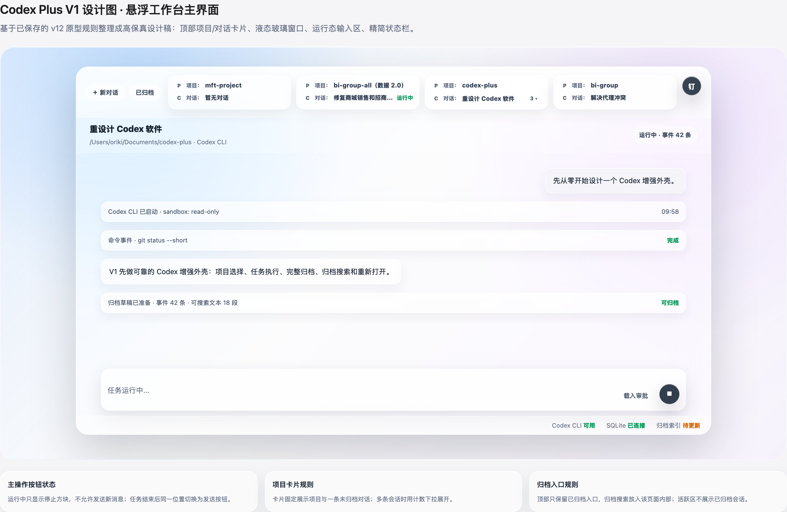

# Codex Plus V1 重设计方案

日期：2026-07-05

## 摘要

Codex Plus V1 是一个原生 macOS 的 Codex 增强外壳。第一版先把 Codex 的基础工作流变成可靠的本地桌面体验：选择项目、启动 Codex CLI 任务、查看完整对话和执行流、继续或停止任务、归档完整对话、搜索已归档对话，并从搜索结果重新打开带有完整事件历史的归档对话。

V1 不是完整的长期记忆产品。V1 中的记忆工作只做本地持久化基础：数据结构、文件、索引和引用关系。这些基础要能支撑后续的记忆卡、记忆注入、自动抽取和审核工作流。手动记忆注入、自动记忆抽取、STAR 复盘和周期回顾都属于 V1 之后的功能。

旧代码库只作为历史产品探索参考。它可以影响交互想法，例如活动悬浮窗口，但 V1 的产品、架构和实现计划应当从头设计。

## 流程硬门

在需求、原型和本设计得到用户确认之前，不得开始开发。

如果用户对任何需求、原型或设计章节不满意，项目必须停留在设计阶段，不进入实现计划或代码修改。

## 产品边界

V1 必须实现：

- 选择项目或工作目录。
- 创建新的 Codex 任务。
- 通过执行引擎适配器运行 Codex CLI。
- 展示用户消息、模型回复、命令事件、错误和原始执行事件。
- 在同一对话中发送后续提示。
- 停止运行中的任务。
- 基础执行模式和权限配置。
- 归档完整对话。
- 搜索已归档对话。
- 从搜索结果重新打开归档对话。
- 为未来记忆功能保留本地数据结构。

V1 不实现：

- 手动把记忆注入当前对话。
- 从已完成任务中自动抽取记忆。
- 完整记忆卡审核看板。
- 把 STAR 复盘生成作为必走流程。
- 周期回顾。
- 相似任务前的记忆推荐。
- Codex CLI 适配器之外的自定义 Agent 执行。
- 插件系统。

## 主要产品界面

### V1 悬浮工作台

V1 优先实现悬浮工作台。它是用户通过快捷键进入 Codex Plus 的主要入口，也是当前任务执行、项目切换、对话切换和归档入口的主要界面。

悬浮工作台的已确认原型为 v12，规则如下：

- 整体使用 macOS 26 液态玻璃风格：半透明材质、背景模糊、细白边和顶部高光。
- 窗口不展示传统软件标题栏。
- 用户点击悬浮窗口外部区域时，只收起窗口，不终止未完成任务。
- 右上角有独立圆形大头钉按钮；固定后点击窗口外部不收起。
- 右侧辅助区域先完全收合，V1 不展示右侧信息面板。
- 左侧导航先不上屏，项目和会话入口上移到顶部工作区。

#### 设计图基准

V1 悬浮工作台主界面的当前设计图保存为：

该图片是 V1 主界面的视觉和布局基准。后续实现时应优先对齐其中的窗口比例、顶部项目卡片层级、聊天区结构、输入区主操作按钮、底部状态栏和液态玻璃视觉方向。

如果后续继续调整界面，必须新增设计图版本或更新原型快照记录，不能只改实现而不更新设计文档。

顶部工作区规则：

- 顶部只保留 `新对话` 和 `已归档` 两个入口。
- `搜索归档` 不作为独立按钮展示；归档搜索放进 `已归档` 页面中。
- 项目与会话以横向卡片展示。
- 每张卡片用两行区分实体：`项目图标 项目：项目名称`，`对话图标 对话：对话名称`。
- 项目没有活跃或未归档会话时，对话行显示 `暂无对话`。
- 项目只有一个活跃或未归档会话时，对话行显示该会话。
- 项目有多个活跃或未归档会话时，卡片仍只展示一条，并显示计数下拉按钮，例如 `3 ▾`，用于展开全部会话。
- 已归档会话不出现在顶部项目卡片或活跃列表中，只能从 `已归档` 入口进入。
- 对话归档操作显示在对应对话上；如果对话仍在运行，点击归档时弹窗确认是否先终止任务再归档。

中间工作区规则：

- 展示完整用户消息、模型回复、命令事件、错误事件和可读执行事件。
- 任务运行中不允许发送新的用户消息。
- 输入区右侧只有一个主操作按钮。
- 任务运行时主按钮显示停止方块，用于停止当前任务。
- 任务完成、失败或停止后，同一个位置切换为发送按钮。
- 停止和发送互斥，不同时展示。

底部状态栏规则：

- 状态栏只展示全局技术状态。
- V1 当前展示：`Codex CLI 可用`、`SQLite 已连接`、`归档索引 待更新`。
- 不展示 `悬浮窗 未固定`。
- 不展示 `任务 后台继续`。

### 完整归档视图

`已归档` 页面是归档搜索和重新打开归档对话的入口。归档搜索属于该页面内部功能，不作为悬浮工作台顶部的独立按钮。

归档对话默认是只读视图。把归档对话恢复成新的活跃对话属于 V1 之后的扩展。

悬浮工作台和完整归档视图必须共享同一套任务、对话和归档数据，不能各自维护副本。

## 信息架构

### 顶部工作区

顶部工作区包含：

- 新对话。
- 已归档。
- 项目横向卡片。
- 每个项目当前展示的一条活跃或未归档对话。
- 多会话下拉入口。
- 对话归档入口。

已归档会话不在顶部工作区展示。

### 中间工作区

中间工作区包含：

- 完整对话消息流。
- 用户提示。
- 模型回复。
- 映射成可读行的 Codex CLI JSON 事件。
- 命令事件。
- 错误和警告行。
- 用于诊断的原始事件保留。
- 后续输入框。
- 运行中停止操作。
- 完成、失败或停止后的归档操作。
- 重新打开的归档对话视图。

### 底部状态栏

底部状态栏包含：

- Codex CLI 可用性。
- SQLite 连接状态。
- 归档索引状态。

### 暂不展示的区域

右侧区域、记忆卡看板、手动记忆注入入口和独立归档搜索按钮都不在 V1 悬浮工作台主界面中展示。右侧后续可以承载记忆和上下文工具，但 V1 不要求实现记忆注入 UI。

## 任务生命周期

V1 任务流程如下：

1. 用户选择或确认项目 / 工作目录。
2. 用户创建对话并发送第一条提示。
3. 应用创建任务记录和对话记录。
4. `CodexCLIEngine` 在选定工作目录中启动 Codex CLI。
5. Codex stdout JSON 事件流入应用。
6. 应用保存原始事件和结构化对话事件。
7. 只要对话保持活跃，用户可以发送后续提示。
8. 用户可以停止运行中的任务。
9. 任务进入已完成、失败或已停止状态。
10. 用户归档对话。
11. 应用写入完整结构化归档和可读 Markdown 归档。
12. 搜索索引更新。
13. 用户可以搜索归档并重新打开完整对话。

任务状态包括：

- 草稿。
- 运行中。
- 已完成。
- 失败。
- 已停止。

只有运行中的任务可以停止。已归档对话必须被保留并可搜索。

## 执行引擎

V1 定义执行引擎抽象，但只实现 `CodexCLIEngine`。

执行引擎接口必须支持：

- 启动任务。
- 继续对话。
- 停止运行中的任务。
- 流式返回原始事件。
- 流式返回结构化展示事件。
- 报告完成、失败和停止结果。
- 暴露用于归档的引擎元数据。

`CodexCLIEngine` 负责：

- 检查 Codex CLI 是否可用。
- 在选定工作目录中启动 Codex CLI。
- 请求 Codex CLI 输出 JSON。
- 解析用户可见事件类型。
- 捕获 stderr。
- 保留原始 JSON 行。
- 停止子进程。
- 清晰报告启动失败。

任务和归档系统必须依赖执行引擎接口，而不是直接依赖 Codex CLI 命令行细节。

未来可以加入的引擎包括：

- OpenAI API Agent 引擎。
- 其他 CLI Agent 引擎。
- 本地模型引擎。
- 远程执行引擎。

## 本地持久化

V1 使用 SQLite 加 Markdown 和附件文件。

SQLite 是结构化数据和 UI 重建的事实来源。Markdown 是可读导出和归档表面，不是唯一持久化表示。

### SQLite 表

`projects`

- 保存项目 ID、展示名称、规范化路径、创建时间、最近打开时间和归档数量元数据。

`conversations`

- 保存对话 ID、项目 ID、标题、状态、引擎 ID、工作目录、创建时间、更新时间、归档时间和归档文件路径。

`conversation_events`

- 保存事件 ID、对话 ID、序号、事件类型、展示文本、结构化 payload JSON、原始引擎 payload、时间戳和可搜索文本。

`archive_index`

- 保存归档 ID、对话 ID、项目 ID、标题、可搜索文本、命令文本、错误文本、项目路径和归档搜索时间戳。

`memory_cards`

- 保存 V1 之后记忆功能所需的本地基础。字段包括卡片 ID、作用范围、类型、标题、摘要、正文、内容形态、状态、创建时间、更新时间和来源元数据。

`memory_sources`

- 将记忆卡关联到来源对话、事件、归档片段、文件路径、截图或附件。

`attachments`

- 保存附件 ID、所属对象类型、所属对象 ID、文件路径、原始文件路径、内容类型、大小、校验和、创建时间，以及它是否是快照副本。

### 记忆卡基础

V1 本地持久化记忆卡，以便后续可以搜索和扩展。

支持的记忆作用范围：

- 项目级。
- 用户级。

支持的内容形态：

- 文字。
- 图片 + 文字。
- 文件引用。
- 文件快照。
- 任务片段。

固定记忆类型：

1. 产品约束。
2. 原型或设计资料。
3. 架构决策。
4. 实现规则或代码约定。
5. 接口或数据契约。
6. 测试边界。
7. Bad Case 或避坑。
8. 操作流程或命令。
9. 复盘或 STAR 记录。

记忆卡也可以拥有自由标签。V1 存储层必须允许在数据模型层面新增、重命名、编辑、删除、编辑摘要、变更作用范围和管理来源。完整记忆管理 UI 不作为 V1 完成条件。

### 文件布局

全局应用数据保存：

- SQLite 数据库。
- 用户级记忆附件。
- 不属于项目本地存储区域的全局归档导出。

项目数据可以保存：

- `.codex-plus/archives/`
- `.codex-plus/memory/`
- `.codex-plus/attachments/`

V1 默认把 SQLite、归档记录、记忆基础和附件保存在全局应用数据中。只有当用户选择项目本地存储，或明确把项目产物导出到项目里时，才创建项目本地 `.codex-plus/` 目录。数据模型必须从一开始就支持全局存储和项目本地存储。

## 归档与搜索

归档必须保存完整对话，而不是只保存摘要。

一次归档包括：

- 项目 ID 和路径。
- 对话元数据。
- 引擎元数据。
- 用户消息。
- 模型回复。
- 命令事件。
- 错误事件。
- 可用时的原始 JSON 行。
- stderr 摘要。
- 完成状态。
- 适用时的创建、更新、完成、停止、失败和归档时间戳。

搜索必须支持：

- 对话标题。
- 项目名称和路径。
- 用户消息。
- 模型回复。
- 命令文本。
- 错误文本。
- 可搜索事件文本。

打开搜索结果时，必须从 SQLite 事件记录重建完整对话。Markdown 导出可以作为可读文档打开，但 UI 重建不能只依赖解析 Markdown。

搜索索引必须可以从已保存的对话和归档记录中重建。

## 错误处理

Codex CLI 缺失：

- 悬浮工作台显示 Codex 不可用。
- 用户可以配置或重试可执行文件路径。
- 引擎不可用前阻止任务创建。

项目路径缺失或不可访问：

- 不启动任务。
- 保留提示草稿和选定项目状态。

Codex 启动失败：

- 对话收到失败事件。
- 保存 stderr 和启动错误细节。

JSON 解析失败：

- 保留原始行。
- UI 显示解析警告。
- 归档保持完整。

任务运行时关闭窗口：

- 关闭窗口不会自动丢弃任务。
- 如果有任务正在运行，退出 App 需要确认。

停止失败：

- 任务记录停止请求失败。
- 保存错误细节。

归档失败：

- 不删除活跃对话。
- 用户可以重试归档。

搜索索引失败：

- 只要完整记录已保存，归档仍然完成。
- 索引之后可以重建。

## 测试目标

核心测试应覆盖：

- 使用 fake engine 测试执行引擎协议行为。
- Codex CLI 事件解析样例。
- 原始 JSON 保留。
- 事件序号顺序。
- 任务状态转换。
- 单个运行任务的停止行为。
- 对话事件持久化。
- 归档记录创建。
- Markdown 归档渲染。
- 搜索索引创建。
- 搜索用户消息、模型回复、命令、错误和项目路径。
- 从已保存事件记录重新打开归档对话。
- 记忆卡 schema 创建和数据层基础 CRUD。

App 冒烟检查应覆盖：

- 从悬浮工作台创建任务。
- 在对话区和顶部项目卡片显示运行状态。
- 从顶部项目卡片切换项目和对话。
- 从 `已归档` 入口搜索并打开归档对话。
- 停止任务。
- 归档已完成对话。
- 搜索并重新打开归档对话。
- Codex CLI 不可用状态。

## V1 完成标准

满足以下条件时，V1 才算完成：

- 用户可以从悬浮工作台创建 Codex 任务。
- 应用显示完整执行过程。
- 应用支持后续提示。
- 应用支持停止运行中的任务。
- 应用可以归档完整对话。
- 应用可以搜索已归档对话。
- 用户可以从搜索结果重新打开完整归档对话。
- 悬浮工作台、顶部项目卡片和完整归档视图共享任务与对话数据。
- 记忆卡数据基础本地存在，但不需要实现注入或自动抽取工作流。

## V1 之后的路线图

V1 之后的功能包括：

- 手动把记忆注入活跃对话。
- 从归档任务中自动抽取记忆。
- 记忆卡审核看板。
- STAR 摘要生成。
- 相似任务前的记忆推荐。
- 周期回顾。
- 完整记忆库 UI。
- 把归档对话恢复成新的活跃对话。
- 其他执行引擎。
- 插件工作流。
