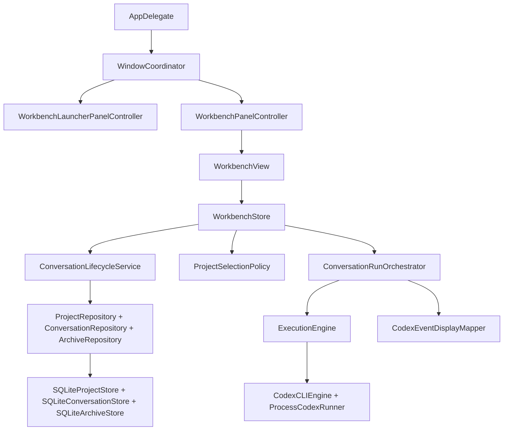

# Codex Plus 架构整改设计

日期：2026-07-07

来源：`docs/code-review-2026-07-07-swift-architecture.md`

## 目标

本设计用于一次系统性整改，覆盖代码审查中发现的所有结构性问题：

- 收敛新旧两套会话与执行链路。
- 拆解过大的 `WorkbenchStore`、`WindowCoordinator`、`CodexPlusRepository`。
- 建立可见错误状态。
- 标准化测试入口，让 `swift test` 能直接运行。
- 降低源码字符串测试、命名漂移、闭包参数膨胀、魔法尺寸和硬编码配置带来的维护成本。
- 为后续产品功能提供稳定、可测试、可演进的 Swift/macOS 架构。

非目标：

- 不重做 UI 视觉风格。
- 不改变归档功能的用户语义。
- 不引入外部依赖或大型框架。
- 不一次性改写所有并发实现为 async/await；先完成边界收敛，再逐步替换高风险 GCD/lock 代码。

## 总体方向

以 Workbench 作为唯一主线体验。旧的 compact/side panel 会话执行链路不再作为产品主流程存在，要么删除，要么移动到 `Legacy` 命名空间并从主装配路径断开。

新的主线分为四层：

1. App Assembly：负责 AppKit 窗口、hotkey、panel 生命周期和依赖装配。
2. Presentation State：负责 SwiftUI 可观察状态、用户 intent 分发、错误展示。
3. Domain Services：负责会话生命周期、项目选择、运行编排、事件映射等业务规则。
4. Infrastructure：负责 SQLite、Codex CLI、文件系统路径、系统监控 provider。

依赖方向只能从外向内：

`CodexPlusApp -> CodexPlusCore services/protocols -> infrastructure implementations`

Core 不依赖 AppKit/SwiftUI。App 层不直接处理会话业务规则。Repository 不再是全能协议。

## 目标架构



## 模块设计

### 1. App Assembly

#### `AppDelegate`

职责：

- 创建 SQLite database。
- 运行 schema migration。
- 创建 repository implementations。
- 创建 `CodexCLIEngine`。
- 创建 `WorkbenchStore`。
- 创建 `WindowCoordinator`。

不再创建：

- `ConversationCoordinator`
- `CodexRunController`
- 旧 side panel 会话链路所需依赖

#### `WindowCoordinator`

职责：

- 管理全局快捷键打开/关闭 Workbench。
- 启动 usage/token/battery monitors。
- 连接 launcher panel 和 workbench panel。
- 处理 `NSWindowDelegate.windowDidMove` 并转发给当前仍存在的 panel controller。

不再负责：

- 创建会话。
- follow-up。
- stop run。
- archive conversation。
- workspace 默认目录创建。
- 权限模式切换业务规则。

期望规模：约 120-180 行。

#### Legacy 处理

如果产品仍需要临时保留旧 compact/side panel 代码：

- 移动到 `Sources/CodexPlusApp/Legacy/`。
- 类型加 `Legacy` 前缀：`LegacyConversationCoordinator`、`LegacySidePanelController`、`LegacyCompactPanelController`。
- 默认 App 装配不引用 legacy 类型。
- 测试不再要求主线文件中包含 legacy 字符串。

如果不需要保留：

- 删除旧面板会话执行链路。
- 保留纯 UI 可复用组件时，移到非 legacy 的 `Views/` 并改成无业务状态组件。

### 2. Presentation State

#### `WorkbenchStore`

职责：

- 持有 `@Published public private(set) var snapshot: WorkbenchSnapshot`。
- 暴露用户 intent 方法，例如 `submitPrompt(_:)`、`selectProject(_:)`、`stopActiveRun()`。
- 调用 domain services 并将结果投影为 snapshot。
- 设置和清除 `WorkbenchErrorState`。

不再直接负责：

- 具体会话状态转移规则。
- 直接维护 execution handle 字典。
- 直接调用 `ArchiveSearchService`。
- 直接吞 repository 错误。

目标形态：

```swift
@MainActor
public final class WorkbenchStore: ObservableObject {
    @Published public private(set) var snapshot: WorkbenchSnapshot

    private var state: WorkbenchState
    private let lifecycle: ConversationLifecycleService
    private let runOrchestrator: ConversationRunOrchestrating
    private let archiveService: ArchiveServicing

    public func submitPrompt(_ prompt: String)
    public func selectProject(_ id: UUID)
    public func selectConversation(_ id: UUID)
    public func beginNewConversationDraft()
    public func stopActiveRun()
    public func clearError()
}
```

#### `WorkbenchState`

新增 Core 内部状态类型，避免 `WorkbenchStore` 散落多个数组和 ID：

```swift
public struct WorkbenchState: Equatable, Sendable {
    public var workspaces: [WorkspaceSessionGroup]
    public var conversations: [ConversationSession]
    public var activeWorkspaceID: UUID?
    public var activeConversationID: UUID?
    public var archiveSearchResults: [ConversationArchiveRecord]
    public var openedArchiveConversation: ConversationSession?
    public var isShowingArchiveSearch: Bool
    public var pendingArchiveConfirmationConversationID: UUID?
    public var isPinned: Bool
    public var error: WorkbenchErrorState?
}
```

`WorkbenchSnapshot` 继续作为 UI read model，但要包含 `error`。

#### `WorkbenchErrorState`

新增用户可见错误状态：

```swift
public struct WorkbenchErrorState: Equatable, Sendable, Identifiable {
    public var id: UUID
    public var title: String
    public var message: String
    public var recoverySuggestion: String?
}
```

错误来源：

- 启动加载 projects/conversations 失败。
- 默认 workspace 创建失败。
- 保存 project/conversation 失败。
- 执行启动失败。
- 归档或搜索失败。

UI 行为：

- `WorkbenchView` 顶部或状态栏显示非阻塞错误。
- 提供关闭按钮调用 `store.clearError()`。
- 不把错误伪装成空数据。

### 3. Domain Services

#### `ConversationLifecycleService`

职责：

- 创建 conversation。
- 追加 follow-up。
- 处理 terminal state：completed、failed、stopped。
- 更新 workspace last activity。
- 持久化 project/conversation。

接口草案：

```swift
public protocol ConversationLifecycleServicing: Sendable {
    func loadInitialState() throws -> WorkbenchState
    func createConversation(prompt: String, workspacePath: String, in state: WorkbenchState) throws -> WorkbenchState
    func appendFollowUp(prompt: String, to conversationID: UUID, in state: WorkbenchState) throws -> WorkbenchState
    func markRunning(_ conversationID: UUID, in state: WorkbenchState) throws -> WorkbenchState
    func markCompleted(_ conversationID: UUID, in state: WorkbenchState) throws -> WorkbenchState
    func markFailed(_ conversationID: UUID, message: String, in state: WorkbenchState) throws -> WorkbenchState
    func markStopped(_ conversationID: UUID, in state: WorkbenchState) throws -> WorkbenchState
}
```

设计原则：

- service 返回新的 state 或 mutation 结果，避免半更新。
- 持久化失败时不更新内存状态。
- 所有失败抛出 `WorkbenchDomainError`，由 Store 映射为 `WorkbenchErrorState`。

#### `ProjectSelectionPolicy`

职责：

- 选择 active project。
- 选择 active conversation。
- 空项目隐藏规则。
- archive/delete 后 fallback 到哪个 project/conversation。

这是纯函数集合，不访问 repository。

#### `ConversationRunOrchestrator`

职责：

- 管理 active run handle。
- 创建 `ExecutionRequest`。
- 接收 `CodexEvent` 并映射为 display event。
- 接收 finish result 并通知 store/lifecycle。
- stop 时先持久化 stopped，再调用 handle.stop。

接口草案：

```swift
@MainActor
public protocol ConversationRunOrchestrating {
    func start(
        conversation: ConversationSession,
        prompt: String,
        onEvent: @escaping (ConversationDisplayEvent) -> Void,
        onFinish: @escaping (CodexRunResult) -> Void
    ) throws

    func stop(conversationID: UUID) -> Bool
    func isRunning(conversationID: UUID) -> Bool
}
```

短期仍可使用当前 `ExecutionEngine.start(...)` 闭包接口。长期可演进为 async stream：

```swift
public protocol AsyncExecutionEngine: Sendable {
    func run(request: ExecutionRequest) -> ConversationRun
}

public struct ConversationRun: Sendable {
    public let events: AsyncStream<CodexEvent>
    public let result: @Sendable () async -> CodexRunResult
    public let stop: @Sendable () -> Void
}
```

#### `CodexEventDisplayMapper`

合并当前重复的 `displayEvent(from:)`：

- `WorkbenchStore.displayEvent(from:)`
- `ConversationCoordinator.displayEvent(from:)`

新类型：

```swift
public enum CodexEventDisplayMapper {
    public static func displayEvent(from event: CodexEvent) -> ConversationDisplayEvent
}
```

### 4. Repository 拆分

当前 `CodexPlusRepository` 拆为五个协议：

```swift
public protocol ProjectRepository: Sendable {
    func saveProject(_ project: WorkspaceSessionGroup) throws
    func loadProjects() throws -> [WorkspaceSessionGroup]
}

public protocol ConversationRepository: Sendable {
    func saveConversation(_ conversation: ConversationSession, projectID: UUID) throws
    func loadConversations() throws -> [ConversationSession]
    func markConversationArchived(_ id: UUID, archiveMarkdownPath: String, archivedAt: Date) throws
}

public protocol ArchiveRepository: Sendable {
    func saveArchiveRecord(_ record: ConversationArchiveRecord) throws
    func searchArchiveRecords(query: String) throws -> [ConversationArchiveRecord]
    func archiveConversation(record: ConversationArchiveRecord, archiveMarkdownPath: String, archivedAt: Date) throws
}

public protocol MemoryRepository: Sendable {
    func saveMemoryCard(_ card: MemoryCard) throws
    func loadMemoryCards(scope: String?) throws -> [MemoryCard]
    func deleteMemoryCard(_ id: UUID) throws
    func saveMemorySource(_ source: MemorySource) throws
    func loadMemorySources(memoryCardID: UUID) throws -> [MemorySource]
    func deleteMemorySource(_ id: UUID) throws
}

public protocol AttachmentRepository: Sendable {
    func saveAttachment(_ attachment: CodexPlusAttachment) throws
    func loadAttachments(ownerKind: String, ownerID: UUID?) throws -> [CodexPlusAttachment]
    func deleteAttachment(_ id: UUID) throws
}
```

SQLite 实现拆分：

- `SQLiteProjectStore`
- `SQLiteConversationStore`
- `SQLiteArchiveStore`
- `SQLiteMemoryStore`
- `SQLiteAttachmentStore`

也可以保留一个 facade：

```swift
public final class SQLiteCodexPlusStore: ProjectRepository, ConversationRepository, ArchiveRepository, MemoryRepository, AttachmentRepository, @unchecked Sendable
```

facade 只负责组合小 store，不再承载全部 SQL。

#### Conversation event codec

新增：

`Sources/CodexPlusCore/Persistence/ConversationEventCodec.swift`

职责：

- `ConversationDisplayEvent -> PersistedConversationEvent`
- `PersistedConversationEvent -> ConversationDisplayEvent`
- payload 使用 `Codable` DTO，而不是 `[String: Any]`。

好处：

- repository 文件变薄。
- 编解码可独立 round-trip 测试。
- 未来新增事件类型时修改面更小。

### 5. 测试体系

#### SwiftPM 标准化

`Package.swift` 改为：

```swift
.testTarget(
    name: "CodexPlusCoreTests",
    dependencies: ["CodexPlusCore"],
    path: "Tests/CodexPlusCoreTests"
)
```

保留 `expect` 风格可以接受，但入口要让 `swift test` 发现。

#### 测试文件重组

目标文件：

- `Tests/CodexPlusCoreTests/TestSupport.swift`
- `Tests/CodexPlusCoreTests/WorkbenchStoreTests.swift`
- `Tests/CodexPlusCoreTests/ConversationLifecycleServiceTests.swift`
- `Tests/CodexPlusCoreTests/ConversationRunOrchestratorTests.swift`
- `Tests/CodexPlusCoreTests/PersistenceTests.swift`
- `Tests/CodexPlusCoreTests/ConversationEventCodecTests.swift`
- `Tests/CodexPlusCoreTests/ProcessCodexRunnerTests.swift`
- `Tests/CodexPlusCoreTests/CodexEventParserTests.swift`
- `Tests/CodexPlusCoreTests/LayoutPolicyTests.swift`

#### 源码字符串断言替换策略

删除这类测试：

- 检查某个 `.swift` 文件是否包含某段私有方法名。
- 检查某个实现细节字符串。
- 检查 UI 代码中是否写了某个具体 modifier。

替换为：

- policy 输入输出测试。
- snapshot state 测试。
- repository round-trip 测试。
- view model/action 测试。

确实需要保护架构边界时，改为轻量 architectural test：

- App target 不能 import SQLite3。
- Core target 不能 import SwiftUI/AppKit。
- 主线 App assembly 不引用 `Legacy` namespace。

### 6. 命名方案

主线命名：

- `WorkbenchStore` 保留为 UI store 名称。
- 新增 `WorkbenchState` 表示内部状态。
- `ConversationLifecycleService` 表示会话生命周期。
- `ConversationRunOrchestrator` 表示执行编排。
- `CodexEventDisplayMapper` 表示事件映射。
- `ProjectSelectionPolicy` 表示纯选择规则。

Legacy 命名：

- `ConversationCoordinator` -> `LegacyConversationCoordinator`
- `CodexRunController` -> `LegacyCodexRunController`
- `SidePanelController` -> `LegacySidePanelController`
- `CompactPanelController` -> `LegacyCompactPanelController`

如果直接删除 legacy，则不做重命名。

结果类型：

- `ArchiveRequestResult` -> `ArchiveConversationOutcome`
- 旧 `ConversationArchiveResult` 随 legacy 删除或重命名为 `LegacyConversationArchiveResult`

### 7. UI action 聚合

Workbench 主线改为小型 action group，避免视图直接知道过多 store 方法。

```swift
struct WorkbenchActions {
    var projectStrip: ProjectStripActions
    var conversation: ConversationActions
    var composer: ComposerActions
    var archive: ArchiveActions
}

struct ComposerActions {
    let send: (String) -> Void
    let stop: () -> Void
    let pickWorkspace: () -> Void
    let clearWorkspace: () -> Void
}
```

原则：

- action group 由 App/Store 装配。
- 子视图只接收自己需要的 action group。
- 子视图不直接承担业务分支。

### 8. Metrics、字符串和配置

#### UI metrics

新增：

`Sources/CodexPlusApp/Workbench/WorkbenchMetrics.swift`

职责：

- panel 默认宽高。
- padding。
- corner radius。
- toolbar/control 高度。

已有组件级 metrics 可以继续保留，例如 `WorkbenchLauncherMetrics`，但通用尺寸不散落到多个文件。

#### UI strings

新增：

`Sources/CodexPlusApp/Workbench/WorkbenchStrings.swift`

先不引入完整 localization，只集中主线中文文案：

- 空状态。
- 错误标题。
- button help/accessibility label。
- archive confirmation 文案。

#### Codex command configuration

`CodexCommandBuilder` 增加配置输入：

```swift
public struct CodexCommandConfiguration: Equatable, Sendable {
    public var skipGitRepoCheck: Bool
    public var sandboxByPermissionMode: [PermissionMode: String]
    public var extraArguments: [String]
}
```

默认配置保持当前行为：

- `--json`
- `--skip-git-repo-check`
- semi automatic -> `read-only`
- full access -> `danger-full-access`

## 数据流

### 新建对话

1. `WorkbenchComposerView` 触发 `ComposerActions.send(prompt)`。
2. `WorkbenchStore.submitPrompt(prompt)` trim 输入。
3. 如果没有 active workspace，调用 `ConversationWorkspacePolicy.createDefaultWorkspaceDirectory()`。
4. `ConversationLifecycleService.createConversation(...)` 创建并持久化 project/conversation。
5. Store 更新 `WorkbenchState`。
6. `ConversationRunOrchestrator.start(...)` 启动执行。
7. event 回调进入 lifecycle append event。
8. finish 回调进入 lifecycle terminal state。
9. Store 每次 state 变化后投影 `WorkbenchSnapshot`。

### Follow-up

1. active conversation 存在且不是 running。
2. lifecycle append user prompt，并设置 running。
3. run orchestrator 启动执行。
4. running 时再次发送，设置 `WorkbenchErrorState`，不追加业务错误 event。

### Stop

1. Store 调用 lifecycle mark stopped。
2. 持久化成功后，run orchestrator stop handle。
3. 若持久化失败，不停止进程，显示错误。

### Archive

1. running conversation archive 请求进入 confirmation。
2. 用户确认后执行 stop 流程。
3. stop 成功后调用 archive service。
4. archive 成功后通过 `ProjectSelectionPolicy` 计算下一 active conversation。
5. archive 失败显示错误，不从 active 列表移除。

## 错误处理

错误分两类：

### 可恢复业务错误

进入 `WorkbenchErrorState`：

- workspace 创建失败。
- repository save/load/search 失败。
- codex process 启动失败。
- 正在运行时提交 follow-up。

UI 显示后允许用户关闭。

### 执行任务错误

保留在 conversation event 中：

- Codex CLI 返回非 0 exit code。
- Codex event parser parse warning。
- turn failed / command failed。

原则：

- 用户操作失败显示在 Workbench error。
- Codex 任务内部失败显示在 conversation timeline。
- 不再静默吞错。

## 并发设计

短期：

- 保持 `ExecutionEngine` 闭包接口，降低一次改动面。
- 删除 `CodexRunController` 后，主线不再使用 `MainActor.assumeIsolated`。
- 所有 Store 状态更新都在 `@MainActor`。

中期：

- `ProcessCodexRunner` 增加 async stream 版本。
- 新增 `AsyncExecutionEngine` 并逐步替换 `ExecutionEngine`。
- 当前 GCD/lock runner 保留到 async 版本测试覆盖齐全后再删。

## 迁移阶段

### Phase 1：主线收敛

目标：

- Workbench 是唯一会话执行体验。
- App 主装配不引用旧 `ConversationCoordinator` / `CodexRunController`。

交付：

- `WindowCoordinator` 只装配 launcher/workbench。
- legacy 文件删除或移入 `Legacy/`。
- 现有测试仍通过。

### Phase 2：Store 和业务服务拆分

目标：

- `WorkbenchStore` 只负责状态发布和 intent。
- 会话生命周期、运行编排、事件映射有独立类型。

交付：

- `WorkbenchState`
- `WorkbenchErrorState`
- `ConversationLifecycleService`
- `ConversationRunOrchestrator`
- `CodexEventDisplayMapper`
- 对应测试

### Phase 3：持久化拆分

目标：

- Repository 按 bounded context 拆分。
- SQLite SQL 和 codec 不再集中在一个大文件。

交付：

- 五个 repository protocol。
- SQLite store 拆分。
- `ConversationEventCodec`。
- codec round-trip 测试。

### Phase 4：测试标准化

目标：

- `swift test` 直接运行全部测试。
- 删除大部分源码字符串断言。

交付：

- `Package.swift` 使用 `.testTarget`。
- `main.swift` 拆分或删除。
- 行为测试覆盖原先结构测试保护的关键场景。

### Phase 5：整理命名、UI actions、metrics、strings、command config

目标：

- 命名反映主线架构。
- UI action 接口可维护。
- 字符串、尺寸、命令配置集中。

交付：

- action group。
- `WorkbenchMetrics`。
- `WorkbenchStrings`。
- `CodexCommandConfiguration`。

### Phase 6：并发演进

目标：

- 用 structured concurrency 降低长期并发维护成本。

交付：

- `AsyncExecutionEngine`。
- async `ProcessCodexRunner`。
- 旧 GCD runner 删除或仅作为 fallback。

## 验收标准

架构验收：

- App 主线不再同时存在两套会话执行状态源。
- `WindowCoordinator` 不含会话业务规则。
- `WorkbenchStore` 明显变薄，核心业务规则在 service/policy 中。
- Repository 协议不再要求实现无关能力。
- 旧 legacy 类型如果存在，路径和命名都明确标记，不被默认装配引用。

功能验收：

- 新建对话、follow-up、stop、archive、archive search 行为保持当前语义。
- 持久化失败、workspace 创建失败、执行启动失败会展示错误，而不是无响应。
- Codex CLI 非 0 退出仍进入 conversation timeline。

测试验收：

- `swift test` 能运行全部测试。
- `swift run CodexPlusCoreTests` 不再是唯一测试入口。
- 行为测试覆盖 531 个现有断言中的核心产品语义。
- 源码字符串断言只保留少量架构边界检查。

代码质量验收：

- `WorkbenchStore` 目标 200-250 行左右。
- `WindowCoordinator` 目标 120-180 行左右。
- 单个 SQLite store 文件只负责一个 table group。
- 新增类型有清晰单一职责。

## 风险和缓解

### 风险：一次性删除 legacy 导致 UI 行为丢失

缓解：

- 先做主线引用断开，再删除。
- 删除前用现有测试和手动测试确认 Workbench 已覆盖当前产品路径。

### 风险：拆 Store 过程中状态回归

缓解：

- 先写 characterization tests。
- 每拆一个 service，只迁移一个 intent。
- 保持 snapshot 形状稳定，避免 UI 同时大改。

### 风险：Repository 拆分影响归档/记忆/附件

缓解：

- 先引入小协议和 facade，不立即删除旧实现。
- 用 adapter 让旧调用逐步迁移。
- 每个 table group 都有 round-trip 测试。

### 风险：测试标准化一次改动太大

缓解：

- 先让 `.testTarget` 可以运行现有 runner。
- 再逐步拆 `main.swift`。
- 每次拆一个主题文件。

## 设计自检

- 覆盖了审查文档中的 P0/P1/P2/P3 问题。
- 没有要求引入新第三方依赖。
- 先收敛主线，再拆服务和持久化，顺序可执行。
- 保留短期兼容路径，避免一次性全量重写。
- 验收标准可以被测试和代码搜索验证。
